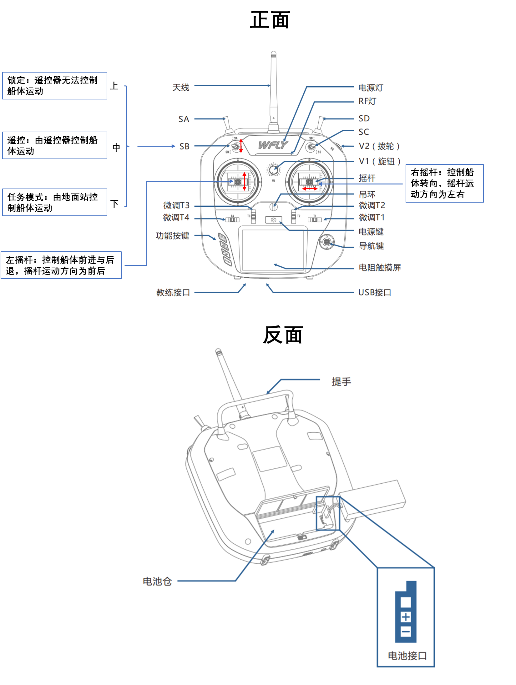
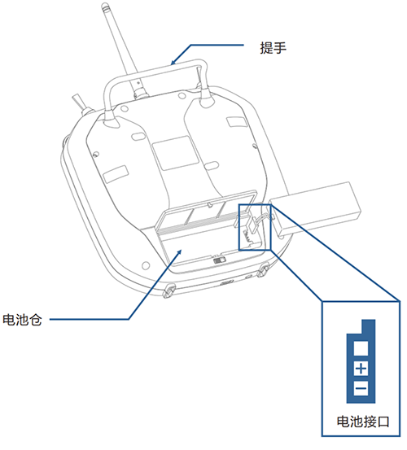
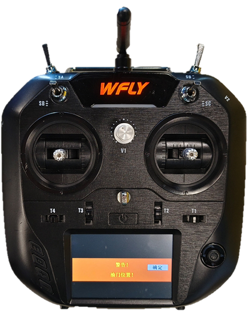
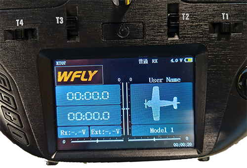

# 遥控器

本节主要介绍软件常用的功能与按键操作演示,遥控器常用控件主要为电源、SB、左右摇杆。

遥控器正面

遥控器反面

## 遥控器主要功能

遥控器的主要功能分为遥控模式与非遥控模式，SB控件分为上、中、下三档，其中、上两档为非遥控模式，此时遥控器的左右摇杆无法控件电机转动。将SB控件拨至最下方，此时为遥控模式，左摇杆往前推动，控制电机往后排水，船体向前运动，左摇杆往后推动，控制电机往前排水，船体向后倒退；右摇杆控制船体转向，右摇杆往左推动，船体往左转，右摇杆往右推动，船体往右转。

## 遥控器操作说明

* 长按遥控器电源键，遥控器启动，蜂鸣器响叫
* 将左摇杆拨至中间位置，同时将SB控件推到最前面，点击触控横屏确定
* 触控屏右上角表示当前遥控器所剩电量，左下角Ext表示船体供电电池所剩电量
* 往下拨动SB控件至底部，由非遥控模式变为遥控模式，往前推动左摇杆，电机往后排水，往后推动左摇杆，电机往前排水，左推右摇杆，右点击往后排水，右推右摇杆，左电机往后排水

遥控器触控屏确定按键

遥控器触控屏信息

